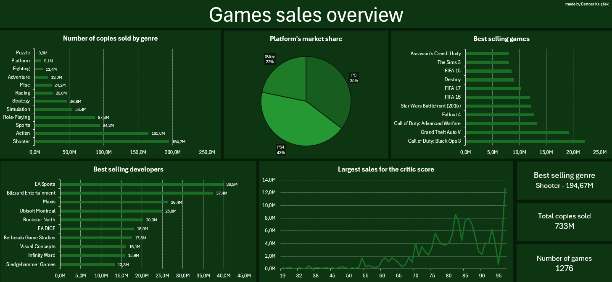
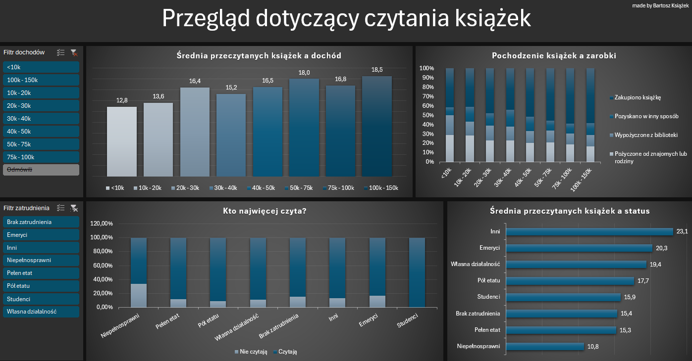
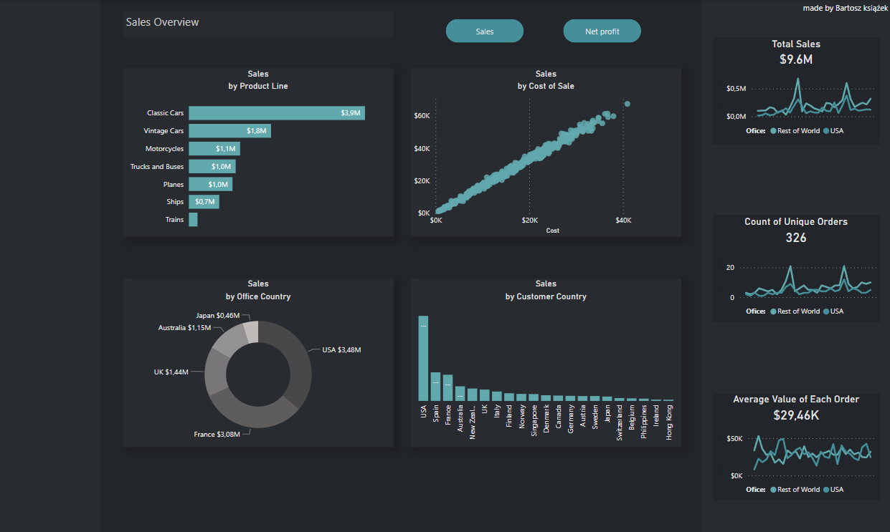
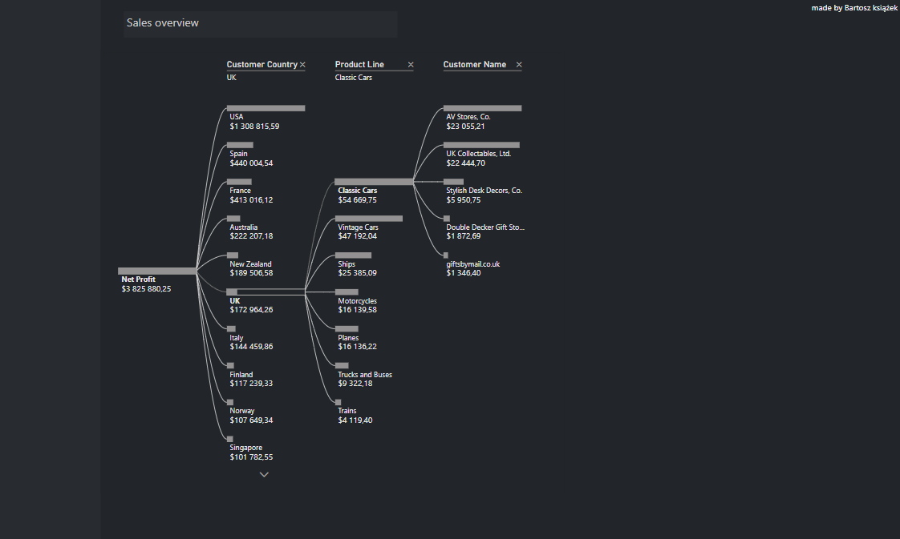

# Visualizations Project
## Excel Visualizations
### 1. Games Sales Overview

This visual presents best selling games, developers, share of platforms in sales and what is the critic score contribution to sales. Before I started creating the visualization, I had to clean up the data, get rid of empty values, and format the cells. Only on a solid foundation can you go further by creating at least pivot tables. 

### 2. Books Reading Overview

This visual presents average books reading in prospect of income or employment, origin of book in prospect of income and who is reading the most. I had to do same things as in previous project to start work on the dataset. Added some slicers to make filtering data easy. This visualization was done in Polish for diversity.

## PowerBi Visualization
### 1. Simple Sales Overview

This visual presents product line sales, sales in prospect of cost of sales, sales by office country and customer country. There is also visualization of net profit from each
customer country and each product line of each customer name. It allows us to see what is the best sales for each country. Data was extracted from a database in MySql workbench.
Also had to write some queries creating views using joins, CTE etc.

